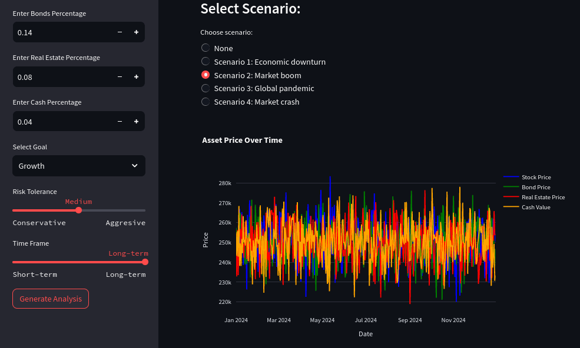

<h1 align="center">FinGEN - AI Finance Solutions</h1>

<p align="center">
  <em>FinGEN is an AI Web Application aimed at young adults looking to improve their financial portfolio.
</em>
</p>

<p align="center">
  <a href="https://streamlit.io/"><strong>Built with Streamlit</strong></a>
  <br>
</p>

<p align="center">
   
</p>

<hr>

## Using the application

- Click here: https://fingen.streamlit.app/

<hr>

## Development setup

### Prerequisites

- Install [Python] and the [pip] package manager

- Optional: use [Poetry] for dependancy/venv management.

### Setting up project

- If using pip

```
pip install -r requirements.txt
```

```
streamlit run main_page.py
```

- If using poetry

```
poetry install
```

```
poetry run streamlit run main_page.py
```

## Acknowledgements

The graphs of our Streamlit app were based on the FinRisk project by [DelinM](https://github.com/delinm/finrisk/blob/main/main_page.py).
